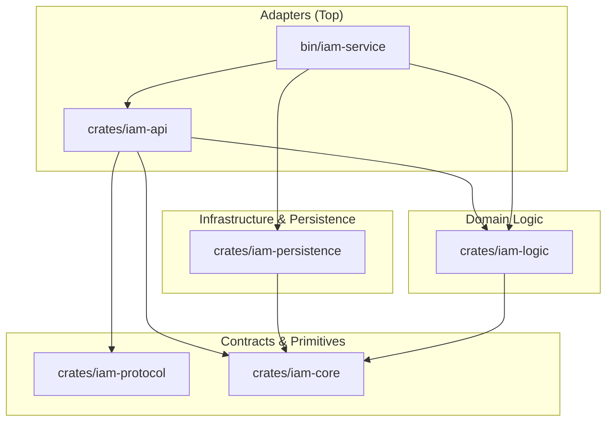

# ARCHITECTURE — gridtokenx-iam-service

This service is the **Identity and Access Management (IAM)** backbone of the GridTokenX platform. It is structured as a **Modular Monolith** Cargo workspace following the "Sync Core, Async Edges" architectural principle.

## 🏗️ Layered Architecture

The workspace enforces strict downward dependency flow. Higher-level adapters never leak into the domain core.



## 📦 Crate Inventory

| Crate | Layer | Responsibility |
|-------|-------|----------------|
| **[iam-service](bin/iam-service)** | Adapter | Entry point, configuration loading, and **Dependency Injection** (orchestration of all layers). |
| **[iam-api](crates/iam-api)** | Adapter | ConnectRPC (gRPC) and REST (Axum) handlers. High-concurrency async edge. |
| **[iam-logic](crates/iam-logic)** | Domain | Core business rules: `AuthService`, `JwtService`, `ApiKeyService`, password hashing, and blockchain provider logic. |
| **[iam-persistence](crates/iam-persistence)** | Infrastructure | Trait implementations: SQLx repos (user/wallet/api_key), Redis cache, and an event bus (Redis Streams + optional Kafka dual-write). |
| **[iam-protocol](crates/iam-protocol)** | Contract | `identity.proto` → codegen via `connectrpc-build`/`buffa-build` (`build.rs`). 7 RPC methods. |
| **[iam-core](crates/iam-core)** | Primitives | Domain models, **Trait definitions**, and shared error types. Zero-dependency heart. |

## 🛠️ Key Design Decisions

### 1. Unified Identity Model
The IAM service manages a unified identity that bridges Web2 (email/password) and Web3 (Solana wallets). The `User` entity is the primary anchor for all platform interactions.

### 2. Trait-Based Dependency Injection (DI)
The Logic layer communicates with Infrastructure ONLY through traits defined in `iam-core`.
- **Decoupling**: Business logic remains 100% agnostic of the underlying database (SQLx) or message broker.
- **Mockability**: Every infrastructure dependency can be swapped with a mock during unit testing.

### 3. Sync Core, Async Edges
- **Sync Core**: Domain models and simple logic are synchronous and deterministic.
- **Async Edges**: I/O-bound operations (API handlers, Database workers) use Tokio's async runtime.
- **Trait Resolution**: Async traits are used sparingly to avoid complex lifetime issues, favoring manual `BoxFuture` for performance-critical or cross-crate shared interfaces.

## 🌐 Surfaces

Both servers are wired in `bin/iam-service/src/startup.rs` and run concurrently with a shared `CancellationToken` for graceful shutdown.

### REST (Axum) — `IAM_PORT` (4010)
- `/api/v1/auth/{register,login,verify,forgot-password,reset-password}` — rate-limited auth flow.
- `/api/v1/users/me`, `/api/v1/users/me/onchain-profile`, `/api/v1/users/me/wallets/*` — profile + wallet CRUD.
- `/api/v1/system/config` — runtime config exposure.
- `/metrics` (Prometheus), `/health`, `/health/ready` (checks Postgres + Redis), `/health/live`.

### gRPC / ConnectRPC — `IAM_GRPC_PORT` (4020, `IAM_PORT + 10`)
`IdentityService` (`proto/identity.proto`) — how Trading and gateways verify identities:
`VerifyToken`, `Authorize`, `GetUserInfo`, `VerifyApiKey`, `RegisterUser`, `LinkWallet`, `InitializeUserWallet`.

## 📡 Observability

Telemetry (tracing / OTel) initializes via the shared **`gridtokenx-telemetry`** workspace crate, re-exported by the local `telemetry` module. `main.rs` calls `telemetry::init_telemetry("gridtokenx-iam")` before `startup::run`. Do not hand-roll a `tracing-subscriber` here — extend the shared crate.

## 🧪 Testing & Quality

The service uses a native Rust testing strategy to ensure rapid feedback cycles:

### Unit Testing (Mock-based)
- **Crate Isolation**: `iam-logic` is tested using `mockall`.
- **Mocks Feature**: `iam-core` provides a `mocks` feature that exports automocked traits (e.g., `MockUserRepositoryTrait`) to other packages without bloating the production binary.
- **Deterministic Logic**: We aim for 100% unit test coverage on the `AuthService` logic.

### Persistence Testing (Integration)
- **Database Tests**: `iam-persistence` uses `sqlx::test` to run integration tests against a real PostgreSQL instance (via Docker).
- **Idempotency**: All database writes are designed to be idempotent to allow safe retries in the event of partial failures.

## ⚙️ Advanced Technical Patterns

### manual `BoxFuture` for Traits
To resolve complex `async_trait` lifetime issues (`E0195`) when sharing traits across crate boundaries (e.g., `BlockchainTrait`), we use the manual `BoxFuture` pattern:

```rust
pub trait BlockchainTrait: Send + Sync {
    fn register_user_on_chain(
        &self,
        authority: Pubkey,
        // ...
    ) -> BoxFuture<'static, Result<Signature>>;
}
```
This ensures guaranteed `dyn` compatibility and stable compilation across the modular monolith workspace.

### Safe Password Handling
Passwords are never stored in plain text or logged.

- **Primary algorithm**: **Argon2** (`argon2` crate) for all new hashes (`password.rs::hash_password`).
- **Legacy verification**: `verify_password` also accepts legacy **Bcrypt** hashes so pre-migration credentials keep working.
- **KDF versioning**: the `users.kdf_version` column tracks the key-derivation generation (`1` = legacy 100k PBKDF2, `2` = 600k), enabling transparent re-hash-on-login migration without forcing resets.
- **CPU safety**: all hash/verify calls run on `spawn_blocking`, bounded by `AUTH_CPU_SEMAPHORE_LIMIT` (see Concurrency below).

## ⚡ Concurrency & CPU Safety

To maintain high throughput and low latency, the service rigorously separates I/O-bound tasks from CPU-bound tasks to avoid **Tokio Worker Starvation**.

### 1. Offloading CPU-Bound Work
Heavy compute tasks (e.g., Password hashing/verification, complex cryptography) MUST NOT run directly on Tokio threads.
- **Pattern**: Use `tokio::task::spawn_blocking` for standard blocking/CPU tasks.
- **Current usage**: Applied in `AuthService` for all password operations.

### 2. Guidance for Rayon Integration
If parallel iterators (`rayon`) are introduced in the future for batch processing:
- **Decoupled Pools**: Rayon and Tokio thread pools must be configured with explicit thread budgets to avoid CFS throttling in containerized environments.
- **Budgeting**: Set `num_threads` based on CPU **requests** (baseline), not limits (burst).
- **Bridge via Oneshot**: Dispatch work to Rayon using `tokio::sync::oneshot` to bridge the async/sync boundary without blocking the executor.
- **Thresholds**: Only use parallel processing for datasets exceeding a measured threshold (e.g., >100 items) to avoid coordination overhead.
