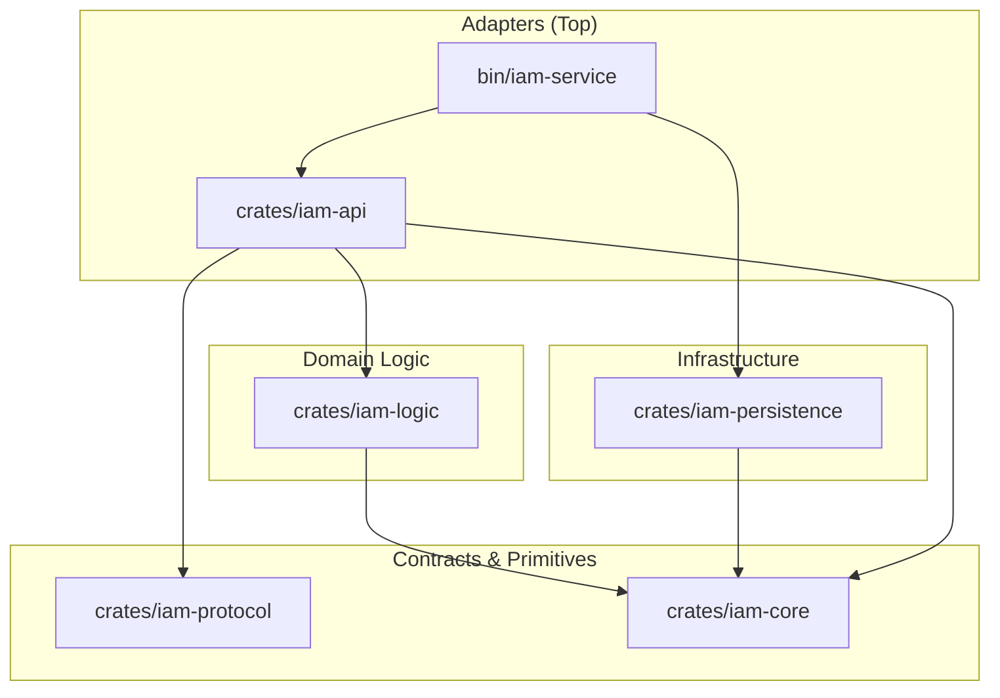

# ARCHITECTURE — gridtokenx-iam-service

This service is the **Identity and Access Management (IAM)** backbone of the GridTokenX platform. It is structured as a **Modular Monolith** Cargo workspace following the "Sync Core, Async Edges" architectural principle.

## 🏗️ Layered Architecture

The workspace enforces strict downward dependency flow. Higher-level adapters never leak into the domain core.

## 📦 Crate Inventory

| Crate | Layer | Responsibility |
|-------|-------|----------------|
| **[iam-service](file:///bin/iam-service)** | Adapter | Entry point, configuration loading, and dependency injection (startup). |
| **[iam-api](file:///crates/iam-api)** | Adapter | ConnectRPC (gRPC) and REST (Axum) handlers. Implements identity and onboarding flows. |
| **[iam-logic](file:///crates/iam-logic)** | Domain | Pure business logic: Authentication orchestration, JWT issuing, and password hashing. |
| **[iam-persistence](file:///crates/iam-persistence)** | Infrastructure | Implementation of PostgreSQL (User/Wallet), Redis (Cache), and Kafka/RabbitMQ (Event Bus). |
| **[iam-protocol](file:///crates/iam-protocol)** | Contract | gRPC service definitions (`identity.proto`) and generated Rust bindings. |
| **[iam-core](file:///crates/iam-core)** | Primitives | Domain models (Identity, User, Role), Trait contracts, and shared Error types. |

## 🛠️ Key Design Decisions

### 1. Unified Identity Model
The IAM service manages a unified identity that bridges Web2 (email/password) and Web3 (Solana wallets). The `User` entity is the primary anchor for all platform interactions.

### 2. Trait-Based Dependency Injection
The Logic layer defines its infrastructure requirements via traits in `iam-core`. This allows the persistence layer to be swapped or mocked without changing business rules.

### 3. Modern Module Layout
Following the project's [skill.md](file:///Users/chanthawat/Developments/gridtokenx-coresystem/gridtokenx-noti-service/skill.md), the repository uses a `lib.rs` + `module.rs` + `module/` directory structure, avoiding legacy `mod.rs` files.

### 4. Operational Health
The service includes a `/health` readiness probe integrated with Docker Compose monitoring, ensuring the platform's foundation is healthy before downstream services start.
