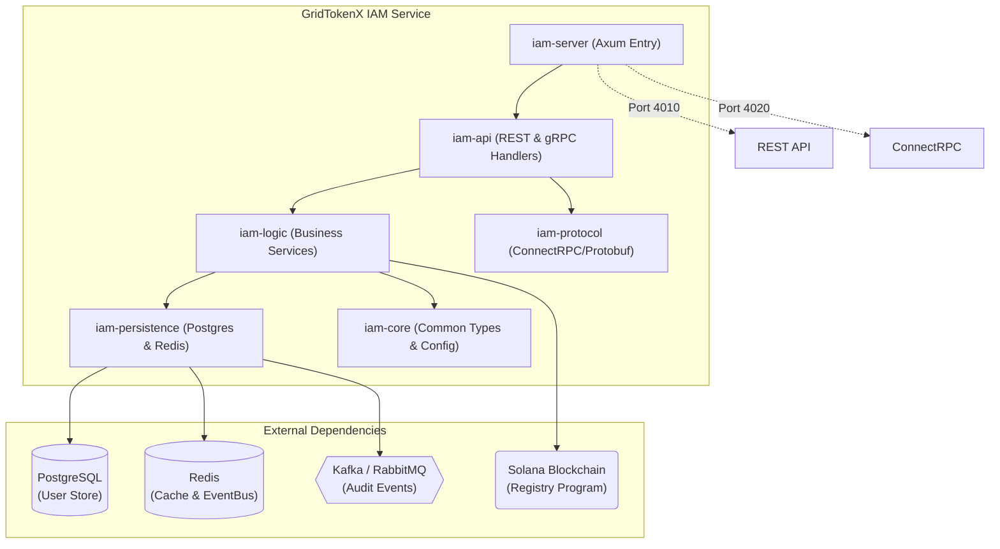
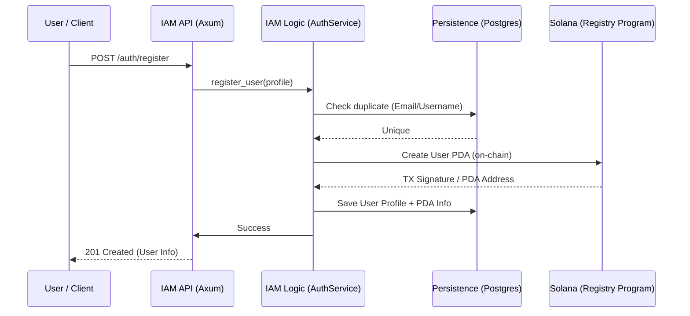
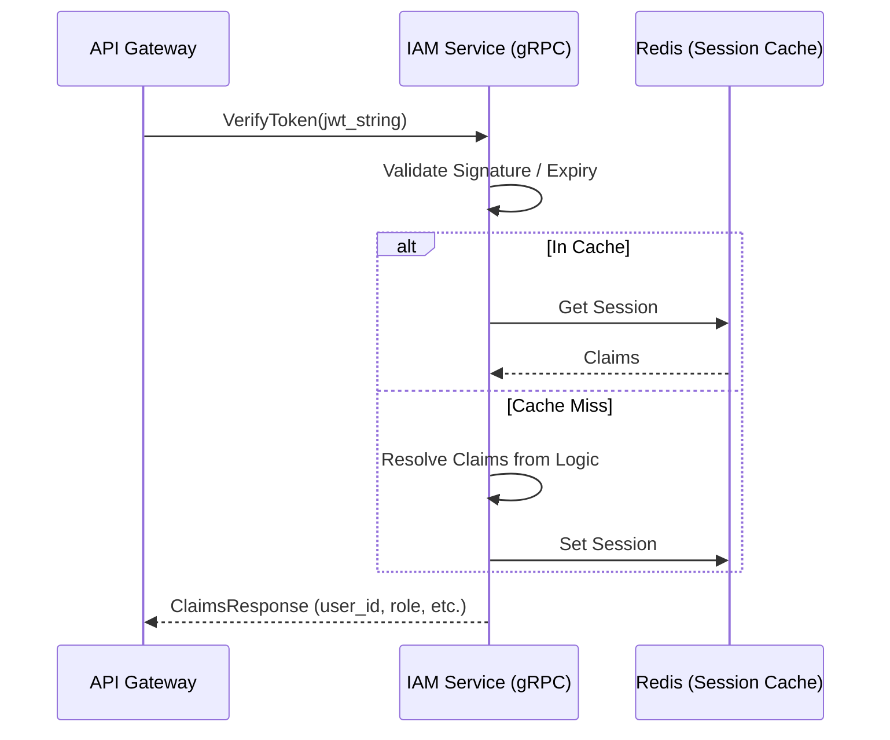

# IAM Service (Identity & Access Management)

The **IAM Service** is the central identity and security authority for the GridTokenX Platform. It manages user lifecycles, authentication, role-based access control (RBAC), and handles on-chain user registration through the Solana Registry program.

---

## 1. Core Architecture

The IAM Service is built as a **Modular Monolith** using Rust, balancing maintainability with high performance. It uses a trait-based dependency injection pattern to ensure clean separation between business logic and infrastructure.

### rchitecture Diagram



---

## 2. Core System Components

The service is divided into specialized crates:

| Crate | Responsibility |
| :--- | :--- |
| **`iam-server`** | Application entry point, server startup, and concurrency management for REST and gRPC servers. |
| **`iam-api`** | Axum route definitions, REST handlers, ConnectRPC service implementations, and middleware. |
| **`iam-logic`** | Heart of the system. Implements `AuthService`, `JwtService`, `ApiKeyService`, and specialized business rules. |
| **`iam-persistence`** | Data access layer. Handles SQLx queries for Postgres, Redis caching, and Event Bus publishers. |
| **`iam-protocol`** | Protobuf definitions and generated ConnectRPC code for cross-service identity communication. |
| **`iam-core`** | Shared domain models, system-wide configuration, error types, and service traits. |

---

## 3. Protocol & Communication

IAM communicates primarily via **ConnectRPC** (gRPC over HTTP/2) for inter-service communication and **JSON/REST** for client-facing operations.

- **REST Port**: `4010` (Internal) / `4001` (Via Gateway)
- **gRPC Port**: `4020`
- **Protocol Definition**: [identity.proto](crates/iam-protocol/proto/identity.proto)

### Inter-service Protocol (ConnectRPC)
Services like the `Trading Service` or `API Gateway` verify user identities using the `IdentityService`:

```protobuf
service IdentityService {
  rpc VerifyToken (TokenRequest) returns (ClaimsResponse);
  rpc Authorize (AuthorizeRequest) returns (AuthorizeResponse);
  rpc GetUserInfo (TokenRequest) returns (UserInfoResponse);
}
```

---

## 4. Protocol Data Flow

### 4.1 User Registration & Onboarding
This flow creates a dual identity: an off-chain record in Postgres and an on-chain PDA (Program Derived Address) in the Solana Registry.



### 4.2 Authentication (JWT Flow)
IAM issues and validates high-entropy JWTs for session management.



---

## 5. Development

### Prerequisites
- **Rust**: Latest stable
- **Database**: PostgreSQL (running on port 7001)
- **Cache**: Redis (running on port 7010)
- **Tooling**: `just`, `sqlx-cli`

### Common Commands
```bash
# Start the service in development mode
just run iam-service

# Run migrations
just migrate iam-service

# Run tests
just test iam-service
```

---

## Related Code
- **Service Root**: [main.rs](crates/iam-server/src/main.rs)
- **Startup & DI**: [startup.rs](crates/iam-server/src/startup.rs)
- **API Handlers**: [iam-api/handlers](crates/iam-api/src/handlers/)
- **Core Business Logic**: [auth_service.rs](crates/iam-logic/src/auth_service.rs)
- **Solana Registry Program**: [registry/lib.rs](../gridtokenx-anchor/programs/registry/src/lib.rs)
- **Identity Protocol**: [identity.proto](crates/iam-protocol/proto/identity.proto)
