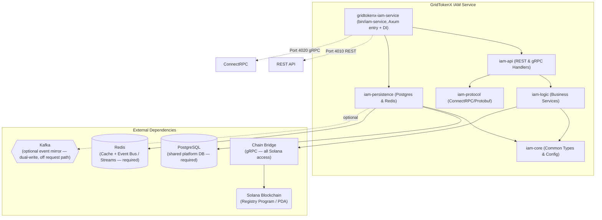
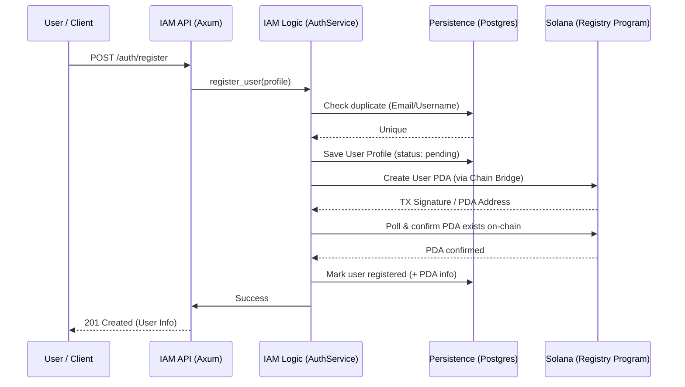
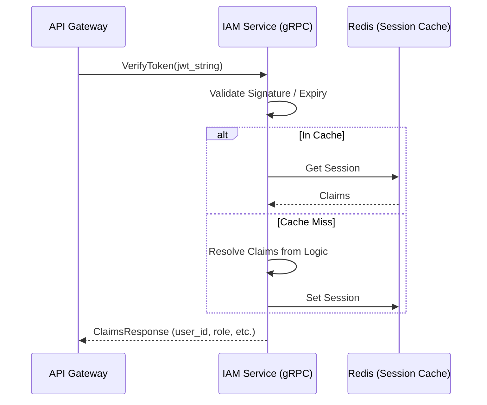

# IAM Service (Identity & Access Management)

The **IAM Service** is the central identity and security authority for the GridTokenX Platform. It manages user lifecycles, authentication, role-based access control (RBAC), and handles on-chain user registration through the Solana Registry program.

---

## 1. Core Architecture

The IAM Service is built as a **Modular Monolith** using Rust, balancing maintainability with high performance. It uses a trait-based dependency injection pattern to ensure clean separation between business logic and infrastructure.

### Architecture Diagram



> **Required vs optional:** Postgres + Redis are hard dependencies (startup fails without). Kafka is an optional event-mirror (dual-write, fire-and-forget, off the request path) — Redis Streams is the primary event bus. RabbitMQ (`lapin`) is wired into config but **not used** by any code path. All Solana access goes through **Chain Bridge**, never direct RPC.

---

## 2. Core System Components

The service is divided into specialized crates:

| Crate | Responsibility |
| :--- | :--- |
| **`gridtokenx-iam-service`** (`bin/iam-service`) | Composition root: entry point, server startup, trait DI wiring, and concurrency management for REST + gRPC. (Older docs call this `iam-server` — stale.) |
| **`iam-api`** | Axum route definitions, REST handlers, ConnectRPC service implementations, and middleware. |
| **`iam-logic`** | Heart of the system. Implements `AuthService`, `JwtService`, `ApiKeyService`, and specialized business rules. |
| **`iam-persistence`** | Data access layer. Handles SQLx queries for Postgres, Redis caching, and Event Bus publishers. |
| **`iam-protocol`** | Protobuf definitions and generated ConnectRPC code for cross-service identity communication. |
| **`iam-core`** | Shared domain models, system-wide configuration, error types, and service traits. |

---

## 3. Protocol & Communication

IAM communicates primarily via **ConnectRPC** (gRPC over HTTP/2) for inter-service communication and **JSON/REST** for client-facing operations.

- **REST Port**: `4010` (bare-metal) / `4001` (via APISIX gateway)
- **gRPC Port**: `4020` (bare-metal; defaults to `IAM_PORT + 10`)
  - **Docker differs:** compose forces `IAM_PORT=8080`/`IAM_GRPC_PORT=8090` *inside* the container; host publishes `4010→8080` (REST) and `${IAM_GRPC_PORT:-5010}→8090` (gRPC). Against the running stack, hit host **`:5010`** or container DNS **`gridtokenx-iam-service:8090`** for gRPC.
- **Protocol Definition**: [identity.proto](crates/iam-protocol/proto/identity.proto)

### Inter-service Protocol (ConnectRPC)
Services like the `Trading Service`, `API Gateway`, `Aggregator Bridge`, or `Meter Service` verify identities via `IdentityService`. Full RPC set:

```protobuf
service IdentityService {
  rpc VerifyToken (TokenRequest) returns (ClaimsResponse);
  rpc Authorize (AuthorizeRequest) returns (AuthorizeResponse);
  rpc GetUserInfo (TokenRequest) returns (UserInfoResponse);
  rpc VerifyApiKey (ApiKeyRequest) returns (ApiKeyResponse);
  rpc RegisterUser (RegisterUserRequest) returns (...);
  rpc LinkWallet (LinkWalletRequest) returns (...);
  rpc InitializeUserWallet (...) returns (...);
  rpc GetUserWallet (...) returns (GetUserWalletResponse);
}
```

### RBAC (fail-closed)
Every RPC gates on the `x-gridtokenx-role` header via `ServiceRole::from_headers → require_any` ([`gridtokenx-blockchain-core/src/auth.rs`](../gridtokenx-blockchain-core/src/auth.rs)); missing/unknown role → `permission_denied`. `Admin` passes everywhere. `ApiGateway` additionally needs `x-gridtokenx-gateway-secret`. Per-method allowlists:

| RPC | Allowed roles |
| :--- | :--- |
| `VerifyToken` | ApiGateway, TradingApi, AggregatorBridge, **MeterService**, Admin |
| `VerifyApiKey` | ApiGateway, AggregatorBridge, Admin |
| `GetUserWallet` | AggregatorBridge, ApiGateway, Admin |
| all others | ApiGateway, Admin |

> The `MeterService` role (`meter-service`, SPIFFE `spiffe://gridtokenx.th/prod/meter-service`) is currently granted `VerifyToken` only.

---

## 4. Protocol Data Flow

### 4.1 User Registration & Onboarding
This flow creates a dual identity: an off-chain record in Postgres and an on-chain PDA (Program Derived Address) in the Solana Registry.



> Current flow **confirms the on-chain PDA before marking the user registered** (commits `f07583a`, `a67f173`); Kafka event emission is decoupled from the request path (commit `2b3e1b3`).

### 4.2 Authentication (JWT Flow)
IAM issues and validates high-entropy JWTs for session management.



---

## 5. Development

### Prerequisites
- **Rust**: Latest stable
- **Database**: PostgreSQL (running on port 7001)
- **Cache**: Redis (running on port 7010)
- **Tooling**: `just`, `sqlx-cli`

### Common Commands
```bash
# Build (if needed) + run with dev env, polls /health on :4010
./start.sh

# Run the binary directly (package name = gridtokenx-iam-service)
cargo run -p gridtokenx-iam-service

# Fast check across the workspace
cargo check

# Run migrations (from the superproject root; IAM owns the shared runner)
just migrate

# Tests — all crates, or one
cargo test
cargo test -p iam-logic
```

---

## Related Code
- **Service Root**: [main.rs](bin/iam-service/src/main.rs)
- **Startup & DI**: [startup.rs](bin/iam-service/src/startup.rs)
- **API Handlers**: [iam-api/handlers](crates/iam-api/src/handlers/)
- **Core Business Logic**: [auth_service.rs](crates/iam-logic/src/auth_service.rs)
- **Solana Registry Program**: [registry/lib.rs](../gridtokenx-anchor/programs/registry/src/lib.rs)
- **Identity Protocol**: [identity.proto](crates/iam-protocol/proto/identity.proto)
